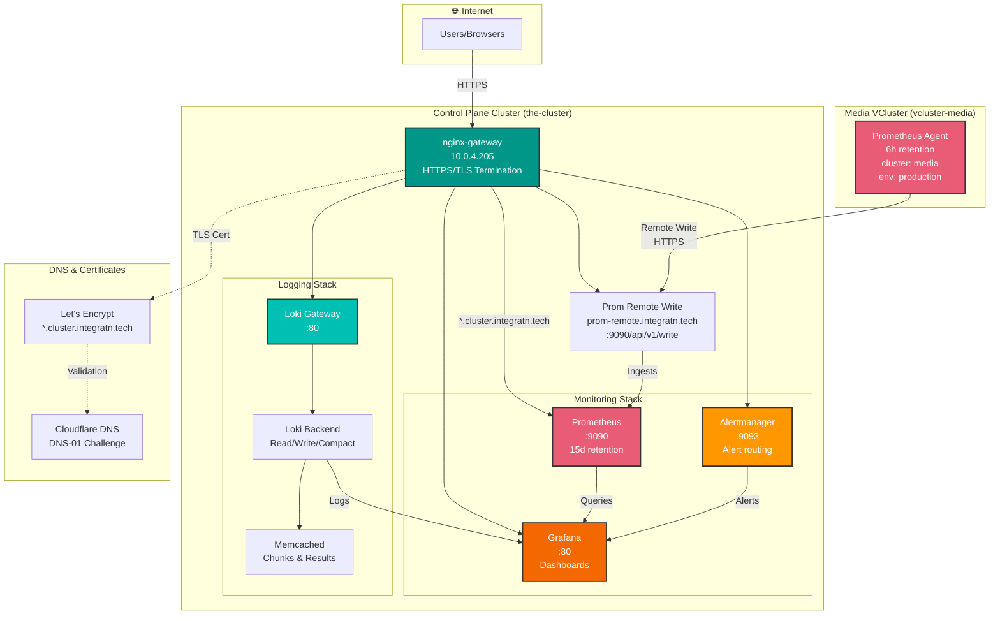
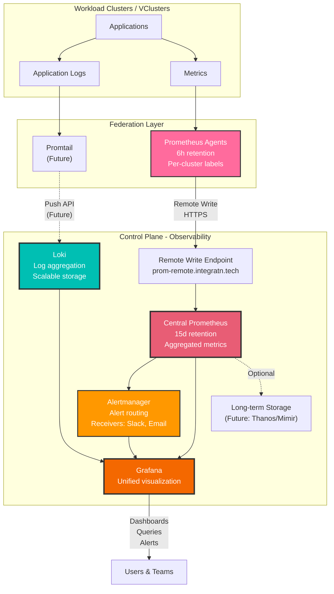

# Monitoring & Logging Configuration Summary

**Date:** January 24, 2026  
**Status:** ✅ COMPLETE - All services operational and accessible

## Architecture Overview



## Exposed Services

| Service | URL | Port | Purpose | Status |
|---------|-----|------|---------|--------|
| **Prometheus** | https://prometheus.cluster.integratn.tech | 9090 | Metrics collection & querying | ✅ Running |
| **Alertmanager** | https://alertmanager.cluster.integratn.tech | 9093 | Alert management & routing | ✅ Running |
| **Grafana** | https://grafana.cluster.integratn.tech | 80 | Visualization & dashboards | ✅ Running |
| **Loki** | https://loki.cluster.integratn.tech | 80 | Log aggregation | ✅ Running |
| **Prom Remote** | https://prom-remote.integratn.tech | 9090 | Remote write endpoint (internal) | ✅ Running |

## Gateway Configuration

**Gateway:** `nginx-gateway` in `nginx-gateway` namespace

**Listeners:**
- `http` (port 80): HTTP traffic with automatic redirect to HTTPS
- `https` (port 443): TLS termination with Let's Encrypt certificate

**Certificate:**
- **Issuer:** letsencrypt-prod (ClusterIssuer)
- **Secret:** wildcard-integratn-tech-tls
- **Domains:** `cluster.integratn.tech`, `*.cluster.integratn.tech`
- **DNS-01 Challenge:** Cloudflare (automated via external-dns)

## HTTPRoute Details

All HTTPRoutes configured in: `addons/cluster-roles/control-plane/addons/observability-secrets/observability-httproutes.yaml`

**Pattern:**
- Each service has two HTTPRoutes:
  1. HTTPS route (port 443) → backend service
  2. HTTP redirect route (port 80) → HTTPS 443

**Example (Prometheus):**
```yaml
# HTTPS Route
apiVersion: gateway.networking.k8s.io/v1
kind: HTTPRoute
metadata:
  name: prometheus
  namespace: monitoring
spec:
  parentRefs:
    - name: nginx-gateway
      namespace: nginx-gateway
      sectionName: https
  hostnames:
    - prometheus.cluster.integratn.tech
  rules:
    - matches:
        - path:
            type: PathPrefix
            value: /
      backendRefs:
        - name: kube-prometheus-stack-prometheus
          port: 9090

# HTTP Redirect
apiVersion: gateway.networking.k8s.io/v1
kind: HTTPRoute
metadata:
  name: prometheus-http-redirect
  namespace: monitoring
spec:
  parentRefs:
    - name: nginx-gateway
      namespace: nginx-gateway
      sectionName: http
  hostnames:
    - prometheus.cluster.integratn.tech
  rules:
    - filters:
        - type: RequestRedirect
          requestRedirect:
            scheme: https
            port: 443
```

## Prometheus Configuration

### Control Plane Prometheus
- **Image:** quay.io/prometheus/prometheus:v2.51.2
- **Retention:** 15 days
- **Storage:** 30Gi PVC (config-nfs-client StorageClass)
- **Replicas:** 1
- **Scrape Interval:** 30s
- **Remote Write Receiver:** Enabled (for vcluster federation)

**Key Settings:**
- AdminAPI: Disabled
- External Labels: `cluster=the-cluster, environment=production`
- WAL Compression: Enabled

### VCluster Prometheus Agent
- **Mode:** Prometheus Agent (federation)
- **Retention:** 6 hours
- **Remote Write:** https://prom-remote.integratn.tech/api/v1/write
- **External Labels:** `cluster=media, environment=production`
- **Scrape Interval:** 30s

## Alertmanager Configuration
- **Image:** quay.io/prometheus/alertmanager
- **Replicas:** 1 (StatefulSet)
- **Storage:** 5Gi PVC (config-nfs-client StorageClass)
- **High Availability:** Enabled (cluster gossip on port 9094)

## Grafana Configuration
- **Image:** grafana/grafana:10.4.1
- **Replicas:** 1
- **Authentication:** Admin credentials via ExternalSecret from 1Password
- **Data Sources:** Auto-configured for Prometheus and Loki
- **Dashboards:** Default Kubernetes dashboards enabled

## Loki Configuration
- **Deployment Mode:** Scalable (microservices)
- **Components:**
  - **loki-gateway:** nginx reverse proxy (80)
  - **loki:** StatefulSet for read/write/backend
  - **loki-chunks-cache:** Memcached for chunk caching
  - **loki-results-cache:** Memcached for query results
  - **loki-canary:** DaemonSet for monitoring
- **Storage:** S3-compatible or filesystem (check values)

## ArgoCD Applications

| Application | Namespace | Server | Sync Status |
|-------------|-----------|--------|-------------|
| kube-prometheus-stack-the-cluster | monitoring | the-cluster | Synced |
| kube-prometheus-stack-agent-vcluster-media | monitoring | vcluster-media | Synced |
| loki-the-cluster | loki | the-cluster | Synced |
| observability-secrets-the-cluster | monitoring/loki | the-cluster | Synced |

## Key Files

### Helm Values
- Control Plane Prometheus: `addons/cluster-roles/control-plane/addons/kube-prometheus-stack/values.yaml`
- VCluster Prometheus Agent: `addons/cluster-roles/vcluster/addons/kube-prometheus-stack-agent/values.yaml`
- Loki: `addons/cluster-roles/control-plane/addons/loki/values.yaml`

### HTTPRoutes
- Main Configuration: `addons/cluster-roles/control-plane/addons/observability-secrets/observability-httproutes.yaml`
- Standalone Files:
  - `addons/clusters/the-cluster/addons/kube-prometheus-stack/httproute-prometheus.yaml`
  - `addons/clusters/the-cluster/addons/kube-prometheus-stack/httproute-alertmanager.yaml`
  - `addons/clusters/the-cluster/addons/loki/httproute-loki.yaml`

### Certificates
- `addons/clusters/the-cluster/addons/nginx-gateway-fabric/certificate-wildcard-cluster-integratn-tech.yaml`

## Access & Authentication

### Grafana
- **URL:** https://grafana.cluster.integratn.tech
- **Credentials:** Stored in 1Password, synced via ExternalSecret
- **Secret:** `grafana-admin` in monitoring namespace

### Prometheus
- **URL:** https://prometheus.cluster.integratn.tech
- **Authentication:** None (consider adding auth proxy if needed)

### Alertmanager
- **URL:** https://alertmanager.cluster.integratn.tech
- **Authentication:** None

## Monitoring Hierarchy



## Future Enhancements

- [ ] Deploy Thanos or Mimir for long-term metrics storage
- [ ] Configure Alertmanager receivers (Slack, email, PagerDuty)
- [ ] Add ServiceMonitors for custom applications
- [ ] Configure Grafana LDAP/OAuth integration
- [ ] Add Loki promtail DaemonSets to vclusters
- [ ] Implement metrics federation from additional vclusters
- [ ] Add custom Grafana dashboards for platform services
- [ ] Configure Prometheus recording rules for performance
- [ ] Set up Velero for backup of monitoring stack
- [ ] Add authentication proxy (OAuth2 Proxy) for public endpoints

## Troubleshooting

### HTTPRoute Not Accepted
**Symptom:** HTTPRoute shows `Accepted: False` in status  
**Common Causes:**
- Wrong listener name (should be `https` or `http`, not `https-public`)
- Backend service doesn't exist
- Gateway not in correct namespace

**Resolution:**
```bash
# Check HTTPRoute status
kubectl get httproute -n <namespace> <name> -o yaml | grep -A 10 "status:"

# Verify backend service exists
kubectl get svc -n <namespace> <backend-name>

# Check Gateway listeners
kubectl get gateway -n nginx-gateway nginx-gateway -o yaml | grep -A 5 "listeners:"
```

### Prometheus Agent Not Sending Metrics
**Symptom:** VCluster metrics not appearing in control plane Prometheus  
**Check:**
```bash
# Verify remote write configuration
kubectl get prometheus -n monitoring -o yaml | grep -A 5 "remoteWrite:"

# Check Prometheus logs
kubectl logs -n monitoring prometheus-kube-prometheus-stack-prometheus-0 -c prometheus

# Test remote write endpoint
curl -k https://prom-remote.integratn.tech/api/v1/write
```

### Loki Not Receiving Logs
**Symptom:** No logs appearing in Grafana Loki data source  
**Check:**
```bash
# Verify Loki pods running
kubectl get pods -n loki

# Check Loki gateway logs
kubectl logs -n loki deployment/loki-gateway

# Test Loki API
curl -k https://loki.cluster.integratn.tech/ready
```

## Validation Commands

```bash
# Check all monitoring pods
kubectl get pods -n monitoring

# Check all loki pods
kubectl get pods -n loki

# Verify all HTTPRoutes accepted
kubectl get httproute -A -o custom-columns=\
NAME:.metadata.name,\
NAMESPACE:.metadata.namespace,\
ACCEPTED:.status.parents[0].conditions[?(@.type==\"Accepted\")].status

# Check Gateway status
kubectl get gateway -n nginx-gateway nginx-gateway

# Test service accessibility
curl -k https://prometheus.cluster.integratn.tech/-/healthy
curl -k https://alertmanager.cluster.integratn.tech/-/healthy
curl -k https://loki.cluster.integratn.tech/ready
curl -k https://grafana.cluster.integratn.tech/api/health
```

## Documentation References
- [Prometheus Operator](https://prometheus-operator.dev/)
- [Grafana Loki](https://grafana.com/docs/loki/latest/)
- [kube-prometheus-stack](https://github.com/prometheus-community/helm-charts/tree/main/charts/kube-prometheus-stack)
- [Gateway API](https://gateway-api.sigs.k8s.io/)
- [nginx-gateway-fabric](https://docs.nginx.com/nginx-gateway-fabric/)
