# Architecture

> **Official Documentation References:**
> - [ArgoCD](https://argo-cd.readthedocs.io/en/stable/) - GitOps Continuous Delivery
> - [Kratix](https://kratix.io/docs/) - Platform as Code
> - [Talos Linux](https://www.talos.dev/) - Kubernetes Operating System
> - [Gateway API](https://gateway-api.sigs.k8s.io/) - Kubernetes Gateway API Specification
> - [vcluster](https://www.vcluster.com/docs/) - Virtual Kubernetes Clusters

## Platform Overview

This repository defines a **GitOps-first homelab platform** built on bare-metal servers running Talos Linux with Kubernetes. The platform uses ArgoCD ApplicationSets for continuous reconciliation of cluster state, while Kratix provides a promise-based platform API for self-service infrastructure provisioning (notably vcluster lifecycle management).

### Core Technology Stack

| Component | Purpose | Version | Why This Choice |
|-----------|---------|---------|-----------------|
| **Talos Linux** | Immutable Kubernetes OS | 1.11.3 | API-driven, secure by default, no SSH access |
| **Kubernetes** | Container orchestration | 1.34.1 | Industry standard, mature ecosystem |
| **ArgoCD** | GitOps CD engine | 9.0.3 | Declarative sync, ApplicationSet support |
| **Kratix** | Platform API framework | Latest | Promise-based abstractions, pipeline automation |
| **ExternalSecrets** | Secret management | 0.10.3 | 1Password integration, no secrets in Git |
| **Gateway API** | HTTP/TLS routing | v1 | Standard API, replaces Ingress |
| **nginx-gateway-fabric** | Gateway controller | Latest | NGINX performance, Gateway API native |
| **MetalLB** | LoadBalancer provider | Latest | L2 mode for bare-metal LoadBalancer IPs |
| **NFS CSI** | Persistent storage | Latest | Simple, proven, homelab-appropriate |

### Architecture Decision Records (ADRs)

#### ADR-001: Why Kratix Over Other Platform Frameworks?
**Decision:** Use Kratix for platform abstractions instead of Crossplane, Backstage, or custom operators.

**Context:** Need a way to offer self-service infrastructure (vclusters, databases, etc.) without users needing deep Kubernetes knowledge.

**Rationale:**
- **Promise-based model** maps naturally to "request this thing, platform provides it"
- **Pipeline approach** allows arbitrary logic (bash scripts, kubectl, API calls)
- **GitOps-native** - promises write to Git state repo, ArgoCD applies
- **Lightweight** - no complex CRD dependencies like Crossplane providers
- **Flexible** - can wrap any automation (Helm, Terraform, APIs)

**Consequences:**
- Pipeline debugging requires examining pod logs
- State repo must be monitored for GitOps reconciliation
- Promise versioning requires careful planning

#### ADR-002: Why Gateway API Over Ingress?
**Decision:** Use Gateway API with nginx-gateway-fabric instead of NGINX Ingress Controller.

**Rationale:**
- **Future-proof** - Gateway API is the Kubernetes standard replacing Ingress
- **Role separation** - GatewayClass (admin) vs Gateway (ops) vs HTTPRoute (dev)
- **Better TLS** - Certificate references are explicit, not annotation-based
- **Multi-protocol** - Not just HTTP/HTTPS (TCP, UDP, TLS passthrough)
- **Type-safe** - Structured spec instead of annotation hell

**Trade-offs:**
- Newer API, less mature tooling than Ingress
- Learning curve for teams familiar with Ingress

#### ADR-003: Why Talos Over Ubuntu/RKE2/K3s?
**Decision:** Run Kubernetes on Talos Linux instead of traditional Linux + kubeadm/RKE2/K3s.

**Rationale:**
- **Immutable** - No package manager, no drift, reproducible nodes
- **Secure by default** - No SSH, API-only management, minimal attack surface
- **API-driven** - Machine config via talosctl, no Ansible/SSH needed
- **Upgrade safety** - Atomic upgrades, rollback support
- **Minimal** - ~80MB ISO, boots in seconds

**Trade-offs:**
- Steeper learning curve (different from traditional Linux)
- Debugging requires talosctl, not SSH
- Limited host access for troubleshooting

#### ADR-004: Why 1Password + ExternalSecrets Over Sealed Secrets/SOPS?
**Decision:** Store secrets in 1Password, pull into Kubernetes via ExternalSecrets Operator.

**Rationale:**
- **Zero secrets in Git** - Even encrypted secrets create compliance/audit burden
- **Centralized management** - 1Password is single source of truth
- **Access control** - 1Password's vaults and permissions
- **Rotation** - Update in 1Password, ExternalSecret auto-syncs
- **Audit trail** - 1Password tracks secret access

**Trade-offs:**
- Dependency on 1Password availability
- Connect API token must be secured
- Slight sync delay compared to Git-native approaches

## System Architecture Diagram


## GitOps Flow (How Changes Propagate)

### Layer 1: Bootstrap (Terraform → ArgoCD)

**Timing:** ~2 minutes on initial bootstrap

1. **Terraform apply** ([terraform/cluster/main.tf](../terraform/cluster/main.tf)):
   ```hcl
   module "argocd" {
     source = "git::https://github.com/jamesAtIntegratnIO/terraform-helm-gitops-bridge.git?ref=homelab"
     
     cluster = {
       cluster_name = "the-cluster"
       environment  = "production"
       addons = {
         enable_argocd = true
         enable_cert_manager = true
         # ... more addons
       }
     }
   }
   ```

2. **ArgoCD installed** via Helm with bootstrap ApplicationSets
3. **Cluster Secret created** with labels:
   ```yaml
   metadata:
     labels:
       cluster_name: the-cluster
       environment: production
       cluster_role: control-plane
       enable_argocd: "true"
       enable_cert_manager: "true"
   ```

4. **Bootstrap ApplicationSet syncs** addons from this repo

### Layer 2: Addons (ApplicationSets → Applications → Helm/Manifests)

**Timing:** ~5 minutes for full addon sync

1. **ApplicationSet chart** ([addons/charts/application-sets](../addons/charts/application-sets/)) renders one ApplicationSet per addon:
   ```yaml
   # Generated ApplicationSet for kube-prometheus-stack
   apiVersion: argoproj.io/v1alpha1
   kind: ApplicationSet
   metadata:
     name: kube-prometheus-stack
     namespace: argocd
   spec:
     goTemplate: true
     generators:
       - clusters:
           selector:
             matchExpressions:
               - key: cluster_role
                 operator: In
                 values: ['control-plane']
           values:
             addonChartVersion: "58.2.1"
     template:
       metadata:
         name: 'kube-prometheus-stack-{{.name}}'
       spec:
         project: platform
         sources:
           - repoURL: https://prometheus-community.github.io/helm-charts
             chart: kube-prometheus-stack
             targetRevision: '{{.values.addonChartVersion}}'
             helm:
               valueFiles:
                 - $values/addons/default/addons/kube-prometheus-stack/values.yaml
                 - $values/addons/cluster-roles/control-plane/addons/kube-prometheus-stack/values.yaml
           - repoURL: https://github.com/jamesatintegratnio/gitops_homelab_2_0
             targetRevision: main
             ref: values
         destination:
           server: '{{.server}}'
           namespace: monitoring
   ```

2. **Application generated** for each matching cluster (the-cluster matches `cluster_role=control-plane`)

3. **Helm chart deployed** with value file precedence:
   - `addons/default/addons/<addon>/values.yaml` (base)
   - `addons/cluster-roles/<role>/addons/<addon>/values.yaml` (role overlay)
   - `addons/environments/<env>/addons/<addon>/values.yaml` (environment overlay)
   - `addons/clusters/<cluster>/addons/<addon>/values.yaml` (cluster-specific)

### Layer 3: Platform Requests (User Request → Kratix Pipeline → State Repo → ArgoCD)

**Timing:** ~30 seconds from CR creation to resource availability

Example: Creating a vcluster named "media"

1. **User commits VClusterOrchestrator CR** to `platform/vclusters/media.yaml`:
   ```yaml
   apiVersion: platform.integratn.tech/v1alpha1
   kind: VClusterOrchestrator
   metadata:
     name: media
     namespace: platform-requests
   spec:
     name: media
     targetNamespace: vcluster-media
     vcluster:
       preset: prod
       replicas: 3
   ```

2. **ArgoCD syncs** `platform-vclusters` Application → CR applied to cluster

3. **Kratix controller watches** `platform-requests` namespace:
   ```
   kratix-platform-controller-manager detects new VClusterOrchestrator
   → Triggers configure pipeline: vcluster-orchestrator
   → Creates Kubernetes Job: kratix-vcluster-orchestrator-media-vco-168ae
   ```

4. **Pipeline executes** ([promises/vcluster-orchestrator/pipelines/configure-pipeline.sh](../promises/vcluster-orchestrator/pipelines/configure-pipeline.sh)):
   ```bash
   # Renders sub-requests for:
   - VClusterCore (namespace, ConfigMap with Helm values)
   - VClusterCoreDNS (host CoreDNS config)
   - VClusterKubeconfigSync (sync to 1Password)
   - VClusterKubeconfigExternalSecret (ExternalSecret CR)
   - VClusterArgocdClusterRegistration (register in ArgoCD)
   - ArgocdProject (create ArgoCD project)
   - ArgocdApplication (deploy vcluster Helm chart)
   ```

5. **Pipeline writes** to kratix-platform-state repo:
   ```
   kratix-platform-state/
     clusters/the-cluster/
       platform-requests/
         vcluster-core-media.yaml
         vcluster-coredns-media.yaml
         vcluster-kubeconfig-sync-media.yaml
         # ... more resources
   ```

6. **State reconciler syncs** state repo → cluster → sub-promises execute → vcluster deployed

### Data Flow: ArgoCD Sync Decision Tree

```mermaid
flowchart TD
    Start["👤 User commits to Git"] --> Sync["🔄 ArgoCD Sync<br/>(every 3min or webhook)"]
    
    Sync --> Check{"📋 Is resource<br/>already in cluster?"}
    Check -->|"YES"| Compare["🔍 Compare spec<br/>sync if different"]
    Check -->|"NO"| Create["➕ Create resource"]
    
    Compare --> Waves
    Create --> Waves
    
    Waves["⚡ Sync Wave Ordering<br/>argocd.argoproj.io/sync-wave"]
    Waves --> Wave-2["Wave -2:<br/>ArgoCD Projects"]
    Wave-2 --> Wave-1["Wave -1:<br/>Namespaces, CRDs"]
    Wave-1 --> Wave0["Wave 0:<br/>Default (most resources)"]
    Wave0 --> Wave1["Wave 1:<br/>Apps depending on Wave 0"]
    Wave1 --> Wave2["Wave 2+:<br/>Higher-order dependencies"]
    
    Wave2 --> Hooks["🪝 Resource Hooks<br/>argocd.argoproj.io/hook"]
    Hooks --> PreSync["PreSync:<br/>backups, prep"]
    PreSync --> SyncH["Sync:<br/>normal sync"]
    SyncH --> PostSync["PostSync:<br/>tests, validation"]
    PostSync --> Health
    
    Health["🏥 Health Assessment"]
    Health --> Healthy["✅ Healthy:<br/>replicas ready"]
    Health --> Degraded["❌ Degraded:<br/>crash loops"]
    Health --> Suspended["⏸️ Suspended:<br/>manual intervention"]
    Health --> Missing["⚠️ Missing:<br/>deleted outside ArgoCD"]
    
    Hooks -.->|"On failure"| SyncFail["💥 SyncFail:<br/>cleanup, rollback"]
    
    style Start fill:#42a5f5,stroke:#fff,stroke-width:2px,color:#fff
    style Sync fill:#5c6bc0,stroke:#fff,stroke-width:2px,color:#fff
    style Waves fill:#ab47bc,stroke:#fff,stroke-width:2px,color:#fff
    style Hooks fill:#ff7043,stroke:#fff,stroke-width:2px,color:#fff
    style Health fill:#ffa726,stroke:#333,stroke-width:2px
    style Healthy fill:#66bb6a,stroke:#fff,stroke-width:2px,color:#fff
    style Degraded fill:#ef5350,stroke:#fff,stroke-width:2px,color:#fff
```



## Cluster Roles & Targeting

Addons are deployed to clusters based on **label selectors** on ArgoCD Cluster Secrets. This allows fine-grained control over which addons run where.

### Cluster Secret Example

```yaml
apiVersion: v1
kind: Secret
metadata:
  name: the-cluster
  namespace: argocd
  labels:
    argocd.argoproj.io/secret-type: cluster
    cluster_name: the-cluster
    environment: production
    cluster_role: control-plane
    enable_argocd: "true"
    enable_cert_manager: "true"
    enable_kratix: "true"
    enable_metallb: "true"
type: Opaque
data:
  name: dGhlLWNsdXN0ZXI=  # base64: the-cluster
  server: aHR0cHM6Ly9rdWJlcm5ldGVzLmRlZmF1bHQuc3Zj  # base64: https://kubernetes.default.svc
  config: <kubeconfig-json>
```

### Common Label Patterns

| Label | Values | Purpose |
|-------|--------|---------|
| `cluster_role` | `control-plane`, `vcluster`, `worker` | Deploy role-specific addons |
| `environment` | `production`, `staging`, `development` | Environment-specific config |
| `enable_<addon>` | `"true"`, `"false"` | Feature flags for addons |
| `cluster_name` | `the-cluster`, `media`, etc. | Unique cluster identifier |

### Addon Selector Examples

From [addons/environments/production/addons/addons.yaml](../addons/environments/production/addons/addons.yaml):

```yaml
# Deploy ArgoCD only to control-plane clusters
argocd:
  enabled: true
  selector:
    matchExpressions:
      - key: enable_argocd
        operator: In
        values: ['true']
      - key: cluster_role
        operator: NotIn
        values: ['vcluster']  # Exclude vclusters

# Deploy Prometheus agent to vclusters
kube-prometheus-stack-agent:
  enabled: true
  valuesFolderName: kube-prometheus-stack-agent
  selector:
    matchExpressions:
      - key: cluster_role
        operator: In
        values: ['vcluster']
```

## Security Architecture

### Trust Boundaries

```
┌─────────────────────────────────────────────────────────────┐


### Secret Management Flow

**Problem:** Secrets must never be committed to Git, even encrypted.

**Solution:** ExternalSecrets Operator + 1Password Connect


**Store secrets in 1Password:**
   ```
   1Password Vault: "Homelab"
     ├─ Item: "grafana-admin"
     │  ├─ Field: "admin-user" → "admin"
     │  └─ Field: "admin-password" → "supersecret123"
     └─ Item: "vcluster-media-kubeconfig"
        └─ Field: "kubeconfig" → "<kubeconfig-yaml>"
   ```

2. **Create ClusterSecretStore** (one-time setup):
   ```yaml
   apiVersion: external-secrets.io/v1beta1
   kind: ClusterSecretStore
   metadata:
     name: onepassword-connect
   spec:
     provider:
       onepassword:
         connectHost: http://onepassword-connect:8080
         vaults:
           Homelab: 1
         auth:
           secretRef:
             connectTokenSecretRef:
               name: onepassword-token
               key: token
               namespace: external-secrets
   ```

3. **Create ExternalSecret:**
   ```yaml
   apiVersion: external-secrets.io/v1beta1
   kind: ExternalSecret
   metadata:
     name: grafana-admin
     namespace: monitoring
   spec:
     secretStoreRef:
       name: onepassword-connect
       kind: ClusterSecretStore
     target:
       name: grafana-admin
     data:
       - secretKey: admin-user
         remoteRef:
           key: grafana-admin
           property: admin-user
       - secretKey: admin-password
         remoteRef:
           key: grafana-admin
           property: admin-password
   ```

4. **External Secrets Operator:**
   - Polls 1Password Connect API every 5 minutes
   - Creates/updates Kubernetes Secret: `grafana-admin`
   - Grafana pods mount secret and use credentials

**Benefits:**
- ✅ No secrets in Git (public or private)
- ✅ Centralized rotation in 1Password
- ✅ Audit trail in 1Password
- ✅ Kubernetes-native consumption (Secret resources)

### Kratix Promise Security

**Critical Rule:** Promises MUST NOT output `kind: Secret` resources.

**Enforcement:**
- Pre-commit hook scans promise directories
- GitHub Actions CI validates promises in PRs
- Rejected: Any pipeline output containing `kind: Secret`
- Required: Use ExternalSecret referencing ClusterSecretStore

**Example (Forbidden):**
```yaml
# ❌ NEVER DO THIS
apiVersion: v1
kind: Secret
metadata:
  name: my-app-password
data:
  password: cGFzc3dvcmQxMjM=  # Exposed in public state repo!
```

**Example (Correct):**
```yaml
# ✅ Always use ExternalSecret
apiVersion: external-secrets.io/v1beta1
kind: ExternalSecret
metadata:
  name: my-app-password
spec:
  secretStoreRef:
    name: onepassword-connect
    kind: ClusterSecretStore
  target:
    name: my-app-password
  data:
    - secretKey: password
      remoteRef:
        key: my-app-vault-item
        property: password
```

## Storage Architecture

### NFS-Based Persistent Volumes

**Why NFS:** Simple, proven, works for homelab scale (~10s of persistent volumes).

**Storage Classes:**
- `config-nfs-client`: SSD-backed NFS for configs (Grafana, Prometheus, Loki)
- `data-nfs-client`: HDD-backed NFS for bulk data (media, backups)
- `nfs-client`: Default NFS (general purpose)

**PVC Example:**
```yaml
apiVersion: v1
kind: PersistentVolumeClaim
metadata:
  name: grafana-storage
  namespace: monitoring
spec:
  accessModes:
    - ReadWriteOnce
  storageClassName: config-nfs-client
  resources:
    requests:
      storage: 5Gi
```

**NFS Provisioner:**
- [nfs-subdir-external-provisioner](https://github.com/kubernetes-sigs/nfs-subdir-external-provisioner)
- Dynamically creates subdirectories on NFS export
- PV lifecycle: Create → Bind → Archive (on PVC deletion)

**Limitations:**
- **No ReadWriteMany for StatefulSets** - Use ReadWriteOnce, one PVC per pod
- **NFS performance** - Not suitable for databases under heavy write load
- **Single point of failure** - NFS server downtime affects all PVCs

## Networking Architecture

### MetalLB L2 Address Pool

**Purpose:** Provide LoadBalancer IPs on bare-metal (no cloud LB available).

**Configuration:**
```yaml
apiVersion: metallb.io/v1beta1
kind: IPAddressPool
metadata:
  name: default
  namespace: metallb-system
spec:
  addresses:
    - 10.0.4.200-10.0.4.253  # 54 IPs available
```

**L2Advertisement:**
```yaml
apiVersion: metallb.io/v1beta1
kind: L2Advertisement
metadata:
  name: default
  namespace: metallb-system
spec:
  ipAddressPools:
    - default
```

**How L2 Mode Works:**
1. Service type=LoadBalancer created
2. MetalLB allocates IP from pool (e.g., 10.0.4.205)
3. MetalLB speaker DaemonSet responds to ARP requests for that IP
4. External traffic reaches node, kube-proxy forwards to service pods

**Gateway LoadBalancer:**
- nginx-gateway-fabric Service gets IP 10.0.4.205
- All HTTP/HTTPS traffic flows through this IP
- HTTPRoutes define hostname → backend service mappings

### Gateway API Routing

**GatewayClass:** (cluster-scoped, installed by nginx-gateway-fabric)
```yaml
apiVersion: gateway.networking.k8s.io/v1
kind: GatewayClass
metadata:
  name: nginx
spec:
  controllerName: gateway.nginx.org/nginx-gateway-controller
```

**Gateway:** (namespace-scoped, defines listeners)
```yaml
apiVersion: gateway.networking.k8s.io/v1
kind: Gateway
metadata:
  name: nginx-gateway
  namespace: nginx-gateway
spec:
  gatewayClassName: nginx
  listeners:
    - name: https
      port: 443
      protocol: HTTPS
      tls:
        mode: Terminate
        certificateRefs:
          - name: wildcard-cluster-integratn-tech
            kind: Secret
      hostname: "*.cluster.integratn.tech"
```

**HTTPRoute:** (application-level routing)
```yaml
apiVersion: gateway.networking.k8s.io/v1
kind: HTTPRoute
metadata:
  name: grafana
  namespace: monitoring
spec:
  parentRefs:
    - name: nginx-gateway
      namespace: nginx-gateway
      sectionName: https
  hostnames:
    - "grafana.cluster.integratn.tech"
  rules:
    - matches:
        - path:
            type: PathPrefix
            value: /
      backendRefs:
        - name: kube-prometheus-stack-grafana
          port: 80
```

**Traffic Flow:**
```
External request: https://grafana.cluster.integratn.tech/dashboards
  ↓
DNS (Cloudflare): grafana.cluster.integratn.tech → 10.0.4.205
  ↓
MetalLB: Routes to nginx-gateway-fabric pod
  ↓
nginx-gateway-fabric: TLS termination, match HTTPRoute
  ↓
HTTPRoute: hostname="grafana.cluster.integratn.tech" → backend=kube-prometheus-stack-grafana:80
  ↓
Service: kube-prometheus-stack-grafana (ClusterIP)
  ↓
Grafana pod(s) in monitoring namespace
```

## Drift Detection & Reconciliation

**Philosophy:** Git is the single source of truth. Manual edits are temporary and should be codified.

### ArgoCD Self-Heal

**Enabled for most apps:**
```yaml
spec:
  syncPolicy:
    automated:
      selfHeal: true  # ArgoCD reverts manual changes
      prune: true     # ArgoCD deletes resources not in Git
```

**Disabled for sensitive apps** (e.g., ArgoCD itself):
```yaml
spec:
  syncPolicy:
    automated:
      selfHeal: false  # Manual sync required
```

### Detecting Drift

1. **ArgoCD UI:** Application status shows "OutOfSync" if cluster state differs from Git
2. **kubectl diff:**
   ```bash
   kubectl diff -f <manifest-file>
   ```
3. **ArgoCD CLI:**
   ```bash
   argocd app diff <app-name>
   ```

### Resolving Drift

**Scenario:** Engineer manually edits a Deployment replica count.

1. **ArgoCD detects OutOfSync** (within 3 minutes)
2. **If selfHeal=true:** ArgoCD reverts to Git value automatically
3. **If selfHeal=false:** Engineer must either:
   - **Option A:** Commit change to Git, sync app
   - **Option B:** Discard manual change, hard refresh app

**Best Practice:** Always commit intent to Git first, let ArgoCD apply.

## Ownership & Drift

Manual edits in the cluster should be avoided. Drift is resolved through Git commits + ArgoCD sync.
