# Observability

> **Official Documentation References:**
> - [kube-prometheus-stack](https://github.com/prometheus-community/helm-charts/tree/main/charts/kube-prometheus-stack) - Complete monitoring stack
> - [Prometheus](https://prometheus.io/docs/) - Metrics collection and storage
> - [Grafana](https://grafana.com/docs/) - Visualization and dashboards
> - [Loki](https://grafana.com/docs/loki/latest/) - Log aggregation
> - [Promtail](https://grafana.com/docs/loki/latest/send-data/promtail/) - Log collection agent
> - [Prometheus Operator](https://prometheus-operator.dev/) - Kubernetes-native Prometheus management

## Architecture Overview

The observability stack follows a **hub-and-spoke model**:
- **Hub (Host Cluster)**: Runs full Prometheus, Grafana, Loki, Alertmanager
- **Spokes (vClusters)**: Run Prometheus agent mode, ship metrics/logs to hub

**Why This Design:**
- **Centralized observability**: Single pane of glass for all clusters
- **Resource efficiency**: vClusters don't run full Prometheus/Grafana
- **Unified alerting**: Alertmanager rules apply across all workloads
- **Cost reduction**: One Grafana license, one storage backend

## Components

### Host Cluster (Full Stack)

Located in [addons/cluster-roles/control-plane/addons/kube-prometheus-stack/values.yaml](../addons/cluster-roles/control-plane/addons/kube-prometheus-stack/values.yaml)

**Prometheus Server:**
```yaml
prometheus:
  service:
    type: ClusterIP
  prometheusSpec:
    enableRemoteWriteReceiver: true  # Accept metrics from vcluster agents
    retention: 15d
    storageSpec:
      volumeClaimTemplate:
        spec:
          storageClassName: config-nfs-client
          accessModes: ["ReadWriteOnce"]
          resources:
            requests:
              storage: 30Gi
```

**Grafana:**
```yaml
grafana:
  defaultDashboardsEnabled: true  # Kubernetes cluster dashboards
  admin:
    existingSecret: grafana-admin  # ExternalSecret from 1Password
    userKey: admin-user
    passwordKey: admin-password
  persistence:
    enabled: true
    storageClassName: config-nfs-client
    size: 5Gi
  dashboardProviders:
    dashboardproviders.yaml:
      apiVersion: 1
      providers:
        - name: default
          orgId: 1
          folder: Kubernetes
          type: file
          options:
            path: /var/lib/grafana/dashboards/default
  dashboards:
    default:
      kubernetes-cluster-monitoring:
        gnetId: 315  # Kubernetes Cluster Monitoring (Prometheus)
        datasource: Prometheus
      node-exporter-full:
        gnetId: 1860  # Node Exporter Full
        datasource: Prometheus
  additionalDataSources:
    - name: Loki
      type: loki
      access: proxy
      url: http://loki-gateway.loki.svc.cluster.local
```

**Alertmanager:**
```yaml
alertmanager:
  enabled: true
  alertmanagerSpec:
    storage:
      volumeClaimTemplate:
        spec:
          storageClassName: config-nfs-client
          accessModes: ["ReadWriteOnce"]
          resources:
            requests:
              storage: 5Gi
```

**Node Exporter:**
- DaemonSet on host nodes (not in vClusters!)
- Exposes node metrics: CPU, memory, disk, network
- Uses `hostNetwork: true` and `hostPID: true` for accurate metrics

### vCluster (Agent Mode)

Located in [addons/cluster-roles/vcluster/addons/kube-prometheus-stack-agent/values.yaml](../addons/cluster-roles/vcluster/addons/kube-prometheus-stack-agent/values.yaml)

**Prometheus Agent Configuration:**
```yaml
prometheus:
  prometheusSpec:
    # Agent mode: scrape and forward, no local storage
    mode: agent
    # Remote write to host Prometheus
    remoteWrite:
      - url: https://prom-remote.cluster.integratn.tech/api/v1/write
        tlsConfig:
          insecureSkipVerify: false
    # Scrape ServiceMonitors/PodMonitors from this vcluster
    serviceMonitorSelectorNilUsesHelmValues: false  # Scrape all ServiceMonitors
    podMonitorSelectorNilUsesHelmValues: false      # Scrape all PodMonitors

# Disabled components (run on host only)
alertmanager:
  enabled: false
grafana:
  enabled: false
prometheus-node-exporter:
  enabled: false  # Can't run in vcluster (requires hostNetwork)

# Enable kube-state-metrics for vcluster workload metrics
kube-state-metrics:
  enabled: true
```

**Why Node Exporter is Disabled in vClusters:**
- Requires `hostNetwork: true`, `hostPID: true`, `hostPath` volumes
- vCluster isolates workloads from host, can't access node metrics
- Host node-exporter covers all nodes, vcluster sees them in Prometheus

### Loki (Log Aggregation)

Located in [addons/cluster-roles/control-plane/addons/loki/values.yaml](../addons/cluster-roles/control-plane/addons/loki/values.yaml)

**Configuration:**
```yaml
loki:
  auth_enabled: false
  commonConfig:
    replication_factor: 1
  schemaConfig:
    configs:
      - from: 2024-01-01
        store: tsdb
        object_store: filesystem
        schema: v13
        index:
          prefix: loki_index_
          period: 24h
  storage:
    type: filesystem
  limits_config:
    allow_structured_metadata: false  # Disable for performance
  persistence:
    enabled: true
    storageClassName: config-nfs-client
    size: 20Gi
```

**Deployment Mode:** SingleBinary (read/write/backend in one pod)
- Simple for homelab scale
- Easy backup/restore (single PVC)
- Can scale to distributed mode later if needed

### Promtail (Log Collection)

**Host Promtail** ([addons/cluster-roles/control-plane/addons/promtail/values.yaml](../addons/cluster-roles/control-plane/addons/promtail/values.yaml)):
```yaml
config:
  clients:
    - url: http://loki-gateway.loki.svc.cluster.local/loki/api/v1/push
  snippets:
    scrapeConfigs: |
      - job_name: kubernetes-pods
        kubernetes_sd_configs:
          - role: pod
        relabel_configs:
          - source_labels: [__meta_kubernetes_pod_label_app]
            target_label: app
          - source_labels: [__meta_kubernetes_namespace]
            target_label: namespace
          - source_labels: [__meta_kubernetes_pod_name]
            target_label: pod
```

**vCluster Promtail** (disabled in favor of host promtail):
- Initially deployed, later disabled
- Host promtail can scrape vcluster pod logs via host node `/var/log/pods/`
- Avoids duplicate DaemonSets and resource overhead

## Data Flow Diagrams

### Metrics Flow (Prometheus)

```mermaid
flowchart TB
    subgraph VCluster["🎯 vCluster: media"]
        Apps["📦 Application Pods<br/>radarr, sonarr<br/>Port :8080/metrics"]
        SM["📊 ServiceMonitor CRD<br/>matchLabels: app=radarr<br/>port: metrics"]
        Agent["🔍 Prometheus Agent<br/>Scrapes every 30s<br/>Adds cluster=media<br/>No local storage"]
        
        Apps --> SM
        SM --> Agent
    end
    
    subgraph HostCluster["☸️ Host Cluster: the-cluster"]
        Gateway["🌐 nginx-gateway-fabric<br/>TLS termination<br/>prom-remote.cluster.integratn.tech"]
        PromServer["📈 Prometheus Server<br/>Receives remote_write<br/>Scrapes host metrics<br/>15d retention, 30Gi"]
        Alert["🚨 Alertmanager<br/>Email/Slack"]
        Grafana["📊 Grafana<br/>Datasource: Prometheus<br/>Dashboards: K8s 315, Node 1860"]
        
        Gateway --> PromServer
        PromServer --> Alert
        PromServer <--> Grafana
    end
    
    Agent -->|"remote_write<br/>POST /api/v1/write<br/>HTTPS"| Gateway
    
    style VCluster fill:#e1bee7,stroke:#8e24aa,stroke-width:2px
    style HostCluster fill:#bbdefb,stroke:#1976d2,stroke-width:2px
    style Agent fill:#ff9800,stroke:#fff,stroke-width:2px,color:#fff
    style PromServer fill:#4caf50,stroke:#fff,stroke-width:2px,color:#fff
    style Grafana fill:#42a5f5,stroke:#fff,stroke-width:2px,color:#fff
```



### Logs Flow (Loki)

```mermaid
flowchart TB
    subgraph AllClusters["📦 All Clusters"]
        Pods["Application Pods<br/>stdout/stderr → Container runtime"]
        HostFS["🗂️ Host Node Filesystem<br/>/var/log/pods/<br/>namespace_pod_uid/<br/>container/0.log"]
        Promtail["📝 Promtail DaemonSet<br/>Mounts /var/log/pods hostPath<br/>Tails log files<br/>Adds labels: namespace, pod, container"]
        
        Pods --> HostFS
        HostFS --> Promtail
    end
    
    subgraph HostCluster["☸️ Host Cluster: the-cluster"]
        Gateway["🌐 nginx-gateway-fabric<br/>TLS termination<br/>loki.cluster.integratn.tech"]
        LokiGW["🚪 Loki Gateway<br/>Reverse proxy<br/>Rate limiting"]
        Loki["📚 Loki SingleBinary<br/>Ingests logs<br/>Indexes by labels<br/>20Gi NFS storage"]
        Grafana["📊 Grafana<br/>Datasource: Loki<br/>Explore: LogQL<br/>Dashboards: Logs panels"]
        
        Gateway --> LokiGW
        LokiGW --> Loki
        Loki <--> Grafana
    end
    
    Promtail -->|"HTTP POST<br/>/loki/api/v1/push<br/>HTTPS"| Gateway
    
    style AllClusters fill:#e1bee7,stroke:#8e24aa,stroke-width:2px
    style HostCluster fill:#bbdefb,stroke:#1976d2,stroke-width:2px
    style Promtail fill:#ff9800,stroke:#fff,stroke-width:2px,color:#fff
    style Loki fill:#4caf50,stroke:#fff,stroke-width:2px,color:#fff
    style Grafana fill:#42a5f5,stroke:#fff,stroke-width:2px,color:#fff
```


│  └──────────────────────────────────────────────────────────┘  │
└─────────────────────────────────────────────────────────────────┘
```

## Endpoints

### External (Gateway-Exposed)

| Service | URL | Purpose | Authentication |
|---------|-----|---------|----------------|
| **Grafana UI** | https://grafana.cluster.integratn.tech | View dashboards, explore metrics/logs | ExternalSecret (1Password) |
| **Prometheus Remote Write** | https://prom-remote.cluster.integratn.tech/api/v1/write | vCluster agents push metrics | None (internal traffic) |
| **Loki Push API** | https://loki.cluster.integratn.tech/loki/api/v1/push | Promtail pushes logs | None (internal traffic) |

### Internal (ClusterIP)

| Service | Cluster IP | Purpose |
|---------|-----------|---------|
| `kube-prometheus-stack-prometheus` | 10.96.x.x:9090 | Prometheus server (PromQL queries) |
| `kube-prometheus-stack-grafana` | 10.96.x.x:80 | Grafana (behind Gateway) |
| `loki-gateway` | 10.96.x.x:80 | Loki ingestion and queries |
| `kube-prometheus-stack-alertmanager` | 10.96.x.x:9093 | Alertmanager UI |

## HTTPRoute Configuration

From [addons/cluster-roles/control-plane/addons/observability-secrets/observability-httproutes.yaml](../addons/cluster-roles/control-plane/addons/observability-secrets/observability-httproutes.yaml):

```yaml
# Grafana UI
apiVersion: gateway.networking.k8s.io/v1
kind: HTTPRoute
metadata:
  name: grafana
  namespace: monitoring
spec:
  parentRefs:
    - name: nginx-gateway
      namespace: nginx-gateway
      sectionName: https
  hostnames:
    - "grafana.cluster.integratn.tech"
  rules:
    - matches:
        - path:
            type: PathPrefix
            value: /
      backendRefs:
        - name: kube-prometheus-stack-grafana
          port: 80

---
# Prometheus Remote Write
apiVersion: gateway.networking.k8s.io/v1
kind: HTTPRoute
metadata:
  name: prometheus-remote-write
  namespace: monitoring
spec:
  parentRefs:
    - name: nginx-gateway
      namespace: nginx-gateway
      sectionName: https
  hostnames:
    - "prom-remote.cluster.integratn.tech"
  rules:
    - matches:
        - path:
            type: PathPrefix
            value: /api/v1/write
      backendRefs:
        - name: kube-prometheus-stack-prometheus
          port: 9090

---
# Loki Push API
apiVersion: gateway.networking.k8s.io/v1
kind: HTTPRoute
metadata:
  name: loki
  namespace: loki
spec:
  parentRefs:
    - name: nginx-gateway
      namespace: nginx-gateway
      sectionName: https
  hostnames:
    - "loki.cluster.integratn.tech"
  rules:
    - matches:
        - path:
            type: PathPrefix
            value: /loki/api/v1/push
      backendRefs:
        - name: loki-gateway
          port: 80
```

## Grafana Dashboard Access

**Login:**
1. Navigate to https://grafana.cluster.integratn.tech
2. Username: Retrieved from ExternalSecret `grafana-admin` in `monitoring` namespace
3. Password: Retrieved from ExternalSecret `grafana-admin` in `monitoring` namespace

**Retrieving Credentials:**
```bash
# Get username
kubectl get secret grafana-admin -n monitoring -o jsonpath='{.data.admin-user}' | base64 -d

# Get password
kubectl get secret grafana-admin -n monitoring -o jsonpath='{.data.admin-password}' | base64 -d
```

**Pre-installed Dashboards:**
- **Kubernetes Cluster Monitoring (gnetId: 315):**
  - Cluster-wide resource usage
  - Namespace breakdowns
  - Pod CPU/memory
  - Persistent volume usage
  
- **Node Exporter Full (gnetId: 1860):**
  - Node-level metrics (CPU, memory, disk, network)
  - System load, uptime
  - Disk I/O, filesystem usage

## PromQL Query Examples

### vCluster Metrics Queries

**CPU usage by vcluster:**
```promql
sum(rate(container_cpu_usage_seconds_total{cluster="media"}[5m])) by (namespace)
```

**Memory usage by vcluster pods:**
```promql
sum(container_memory_working_set_bytes{cluster="media"}) by (pod, namespace)
```

**vCluster workload count:**
```promql
count(kube_pod_info{cluster="media"})
```

**Network traffic by vcluster:**
```promql
sum(rate(container_network_receive_bytes_total{cluster="media"}[5m]))
```

### Host Cluster Queries

**Node CPU utilization:**
```promql
100 - (avg(rate(node_cpu_seconds_total{mode="idle"}[5m])) by (instance) * 100)
```

**Node memory usage:**
```promql
(node_memory_MemTotal_bytes - node_memory_MemAvailable_bytes) / node_memory_MemTotal_bytes * 100
```

**Disk space remaining:**
```promql
(node_filesystem_avail_bytes{mountpoint="/"} / node_filesystem_size_bytes{mountpoint="/"}) * 100
```

**ArgoCD application sync status:**
```promql
argocd_app_info{sync_status!="Synced"}
```

## LogQL Query Examples

### Find logs from specific vcluster pod:**
```logql
{namespace="vcluster-media", pod="radarr-7d67f5869f-tpgdw"}
```

**Filter logs with error level:**
```logql
{namespace="monitoring"} |= "level=error"
```

**Count error logs per minute:**
```logql
sum(rate({namespace="vcluster-media"} |= "error" [1m]))
```

**Parse JSON logs and filter:**
```logql
{namespace="monitoring"} | json | level="error" | line_format "{{.message}}"
```

## ServiceMonitor / PodMonitor Examples

**ServiceMonitor (application metrics):**
```yaml
apiVersion: monitoring.coreos.com/v1
kind: ServiceMonitor
metadata:
  name: radarr
  namespace: media
  labels:
    app: radarr
spec:
  selector:
    matchLabels:
      app: radarr
  endpoints:
    - port: metrics
      interval: 30s
      path: /metrics
```

**PodMonitor (pod-level metrics):**
```yaml
apiVersion: monitoring.coreos.com/v1
kind: PodMonitor
metadata:
  name: vcluster-etcd
  namespace: vcluster-media
spec:
  selector:
    matchLabels:
      app: vcluster-etcd
  podMetricsEndpoints:
    - port: metrics
      interval: 30s
```

## Host vs vCluster Metrics

| Metric Source | What It Measures | Where It Comes From |
|---------------|------------------|---------------------|
| **Host node metrics** | CPU, memory, disk, network of physical/VM nodes | `prometheus-node-exporter` DaemonSet on host |
| **vCluster workload metrics** | Pod CPU, memory, network inside vcluster | Prometheus agent + kube-state-metrics in vcluster |
| **vCluster control plane metrics** | vcluster API server, etcd, syncer | Prometheus agent scraping vcluster system pods |
| **Kubernetes object metrics** | Deployment status, pod count, PVC usage | kube-state-metrics (host and vcluster) |

**Key Insight:** vCluster workloads are labeled with `cluster="media"` to distinguish them from host workloads in Grafana.

## Operational Checks

### Verify Metrics Collection

**Check Prometheus targets in host cluster:**
```bash
kubectl port-forward -n monitoring svc/kube-prometheus-stack-prometheus 9090:9090
# Open http://localhost:9090/targets
# Look for vcluster-media ServiceMonitors
```

**Check Prometheus agent in vcluster:**
```bash
kubectl port-forward -n vcluster-media svc/kube-prometheus-stack-prometheus 9090:9090
# Open http://localhost:9090/targets
# Should see vcluster workload ServiceMonitors
```

### Verify Logs Collection

**Check Promtail is shipping logs:**
```bash
kubectl logs -n promtail daemonset/promtail --tail=50
# Should see "POST /loki/api/v1/push HTTP/1.1" 204
```

**Check Loki ingestion:**
```bash
kubectl logs -n loki loki-0 --tail=50
# Should see "level=info msg="POST /loki/api/v1/push"
```

**Query logs in Grafana Explore:**
```logql
{namespace="vcluster-media"} | limit 100
```

### Verify vCluster Metrics in Grafana

1. Open Grafana: https://grafana.cluster.integratn.tech
2. Navigate to Explore
3. Select Prometheus datasource
4. Query: `{cluster="media"}`
5. Should return metrics labeled with vcluster name

## Troubleshooting

### Missing Metrics from vCluster

**Symptom:** vCluster workloads not visible in Grafana.

**Diagnosis:**
1. Check Prometheus agent is running:
   ```bash
   kubectl get pods -n vcluster-media -l app=kube-prometheus-stack-prometheus
   ```

2. Check ServiceMonitor/PodMonitor selector configuration:
   ```bash
   kubectl get prometheusagent -n vcluster-media -o yaml | grep -A 5 "serviceMonitorSelector"
   ```

3. Verify remote_write configuration:
   ```bash
   kubectl get prometheusagent -n vcluster-media -o yaml | grep -A 10 "remoteWrite"
   ```

4. Check remote_write endpoint is reachable:
   ```bash
   kubectl exec -it -n vcluster-media <prometheus-pod> -- wget -O- https://prom-remote.cluster.integratn.tech/api/v1/write
   ```

**Common Causes:**
- ❌ `serviceMonitorSelectorNilUsesHelmValues: true` (should be `false` to scrape all)
- ❌ Remote write URL incorrect or gateway not routing
- ❌ TLS cert validation failing (`insecureSkipVerify` might be needed for testing)
- ❌ ServiceMonitor/PodMonitor missing `release: kube-prometheus-stack` label

**Fix:**
```yaml
# In vcluster agent values
prometheus:
  prometheusSpec:
    serviceMonitorSelectorNilUsesHelmValues: false
    podMonitorSelectorNilUsesHelmValues: false
```

### Missing Logs from Pods

**Symptom:** Pod logs not appearing in Loki/Grafana.

**Diagnosis:**
1. Check Promtail is running:
   ```bash
   kubectl get pods -n promtail
   ```

2. Check Promtail can access host logs:
   ```bash
   kubectl exec -it -n promtail <promtail-pod> -- ls /var/log/pods/
   ```

3. Check Promtail config:
   ```bash
   kubectl get cm -n promtail promtail -o yaml
   ```

4. Check Loki is receiving logs:
   ```bash
   kubectl logs -n loki loki-0 | grep "POST /loki/api/v1/push"
   ```

**Common Causes:**
- ❌ Promtail not mounted to `/var/log/pods` as hostPath
- ❌ PodSecurity policy blocking Promtail privileged access
- ❌ Loki gateway unreachable from Promtail
- ❌ Loki volume full (check PVC usage)

**Fix:**
```bash
# Check PVC usage
kubectl get pvc -n loki
kubectl exec -it -n loki loki-0 -- df -h /loki
```

### Grafana Login Fails

**Symptom:** Incorrect credentials or "Invalid username or password".

**Diagnosis:**
1. Check ExternalSecret sync status:
   ```bash
   kubectl get externalsecret -n monitoring grafana-admin
   ```

2. Check Secret exists and has data:
   ```bash
   kubectl get secret -n monitoring grafana-admin -o yaml
   ```

3. Check 1Password Connect is reachable:
   ```bash
   kubectl logs -n external-secrets deployment/external-secrets
   ```

**Common Causes:**
- ❌ ExternalSecret not synced (check 1Password connectivity)
- ❌ 1Password item name/field mismatch
- ❌ ClusterSecretStore misconfigured

**Fix:**
```bash
# Force ExternalSecret refresh
kubectl annotate externalsecret -n monitoring grafana-admin force-sync="$(date +%s)" --overwrite

# Check sync status
kubectl describe externalsecret -n monitoring grafana-admin
```

### Prometheus Disk Full

**Symptom:** Prometheus pod CrashLoopBackOff, "no space left on device" in logs.

**Diagnosis:**
```bash
kubectl exec -it -n monitoring prometheus-kube-prometheus-stack-prometheus-0 -- df -h /prometheus
```

**Fix Options:**
1. **Increase PVC size:**
   ```yaml
   # Edit values.yaml
   prometheus:
     prometheusSpec:
       storageSpec:
         volumeClaimTemplate:
           spec:
             resources:
               requests:
                 storage: 50Gi  # Increased from 30Gi
   ```

2. **Reduce retention:**
   ```yaml
   prometheus:
     prometheusSpec:
       retention: 7d  # Reduced from 15d
   ```

3. **Expand PVC (if NFS provisioner supports):**
   ```bash
   kubectl patch pvc -n monitoring prometheus-kube-prometheus-stack-prometheus-db-prometheus-kube-prometheus-stack-prometheus-0 -p '{"spec":{"resources":{"requests":{"storage":"50Gi"}}}}'
   ```

## Performance Tuning

### Prometheus Query Optimization

**Slow queries:**
- Use recording rules for frequently-used queries
- Limit query range (`[5m]` instead of `[1h]`)
- Use aggregation (`sum`, `avg`) to reduce cardinality

**Recording Rule Example:**
```yaml
apiVersion: monitoring.coreos.com/v1
kind: PrometheusRule
metadata:
  name: custom-rules
  namespace: monitoring
spec:
  groups:
    - name: vcluster
      interval: 30s
      rules:
        - record: vcluster:cpu:sum
          expr: sum(rate(container_cpu_usage_seconds_total{cluster=~".*"}[5m])) by (cluster)
```

### Loki Query Optimization

**LogQL best practices:**
- Use label filters before line filters: `{namespace="monitoring"} |= "error"`
- Avoid regex on high-cardinality fields
- Use `| json` to parse structured logs instead of regex
- Limit query time range to reduce scan

### Resource Limits

**Prometheus:**
```yaml
resources:
  requests:
    cpu: 500m
    memory: 2Gi
  limits:
    cpu: 2000m
    memory: 4Gi
```

**Grafana:**
```yaml
resources:
  requests:
    cpu: 100m
    memory: 256Mi
  limits:
    cpu: 500m
    memory: 512Mi
```

**Loki:**
```yaml
resources:
  requests:
    cpu: 500m
    memory: 1Gi
  limits:
    cpu: 1000m
    memory: 2Gi
```

## Key Files

- Host stack values: [addons/cluster-roles/control-plane/addons/kube-prometheus-stack/values.yaml](../addons/cluster-roles/control-plane/addons/kube-prometheus-stack/values.yaml)
- vCluster agent values: [addons/cluster-roles/vcluster/addons/kube-prometheus-stack-agent/values.yaml](../addons/cluster-roles/vcluster/addons/kube-prometheus-stack-agent/values.yaml)
- Loki values: [addons/cluster-roles/control-plane/addons/loki/values.yaml](../addons/cluster-roles/control-plane/addons/loki/values.yaml)
- Promtail values: [addons/cluster-roles/control-plane/addons/promtail/values.yaml](../addons/cluster-roles/control-plane/addons/promtail/values.yaml)
- HTTPRoutes: [addons/cluster-roles/control-plane/addons/observability-secrets/observability-httproutes.yaml](../addons/cluster-roles/control-plane/addons/observability-secrets/observability-httproutes.yaml)
- Grafana admin secret: [addons/cluster-roles/control-plane/addons/observability-secrets/grafana-admin-external-secret.yaml](../addons/cluster-roles/control-plane/addons/observability-secrets/grafana-admin-external-secret.yaml)
