# vCluster Platform

> **Official Documentation References:**
> - [vCluster Documentation](https://www.vcluster.com/docs/) - Virtual Kubernetes clusters
> - [vCluster Architecture](https://www.vcluster.com/docs/architecture/basics) - How vCluster works
> - [vCluster Helm Chart](https://github.com/loft-sh/vcluster/tree/main/chart) - Configuration options
> - [Kratix](https://kratix.io/docs/) - Platform-as-a-Product framework

## Overview

vClusters are **virtual Kubernetes clusters** that run inside a host Kubernetes cluster. They provide isolated, multi-tenant environments without the overhead of managing separate physical clusters.

**Key Concepts:**
- **Virtual Control Plane**: Each vCluster has its own API server, controller-manager, and etcd/database
- **Syncer**: Bidirectional sync between vCluster resources and host cluster pods
- **Isolation**: Namespaces, RBAC, and network policies are scoped to the vCluster
- **Host Integration**: vClusters can use host cluster storage, networking, and operators

**Benefits:**
- ✅ **Cost effective**: 20+ vClusters per physical node (vs 1-3 full clusters)
- ✅ **Fast provisioning**: New cluster in ~60 seconds (vs 10+ minutes for real cluster)
- ✅ **Resource efficient**: Control plane uses ~200MB RAM (vs 2GB+ for full cluster)
- ✅ **True isolation**: Each vCluster has independent RBAC, CRDs, webhooks
- ✅ **Kubernetes native**: Standard kubectl/helm workflows work unchanged
- ✅ **GitOps ready**: vClusters are declarative and reproducible

**Use Cases:**
- Development/staging environments per team
- CI/CD pipeline isolation
- Customer-dedicated clusters (SaaS multi-tenancy)
- Testing Kubernetes upgrades safely
- Ephemeral clusters for automated testing

## Architecture Diagram

```mermaid
graph TB
    subgraph Physical["⚙️ Physical Cluster: the-cluster"]
        subgraph NS1["📦 Namespace: vcluster-media"]
            subgraph CP["🎛️ vCluster Control Plane (StatefulSet: media)"]
                subgraph Pod["Pod: media-0"]
                    Syncer["🔄 syncer container<br/>Watches vCluster API<br/>Creates host resources<br/>Syncs status back"]
                    API["🌐 k8s-api container<br/>kube-apiserver :6443<br/>Serves vCluster K8s API"]
                    CM["⚙️ controller-manager<br/>K8s controller loops"]
                    ETCD["💾 etcd container<br/>vCluster state storage<br/>3 replicas (HA)"]
                end
            end
            
            Workloads["🔧 Synced Workload Pods<br/>myapp-xyz-x-default-x-media<br/>Labels: vcluster.loft.sh/managed-by=media<br/>Uses host CNI & StorageClasses"]
        end
        
        subgraph ArgoNS["📦 Namespace: argocd"]
            ClusterSecret["🔑 Secret: media-cluster<br/>ArgoCD cluster registration<br/>cluster_name: media<br/>cluster_role: vcluster<br/>server: https://media.vcluster-media.svc<br/>config: kubeconfig"]
        end
    end
    
    subgraph Dev["👤 Developer Experience"]
        DevKubectl["💻 kubectl --context media<br/>get pods → myapp-xyz<br/>(Clean namespace, no clutter)"]
    end
    
    API <--> Syncer
    Syncer --> Workloads
    DevKubectl -->|"Connects to"| API
    
    style Physical fill:#bbdefb,stroke:#1976d2,stroke-width:2px
    style NS1 fill:#e1bee7,stroke:#8e24aa,stroke-width:2px
    style CP fill:#fff3e0,stroke:#ff9800,stroke-width:2px
    style Pod fill:#e0f7fa,stroke:#00acc1,stroke-width:2px
    style Dev fill:#c8e6c9,stroke:#388e3c,stroke-width:2px
    style Syncer fill:#42a5f5,stroke:#fff,stroke-width:2px,color:#fff
```



## vCluster Request Flow (Complete Lifecycle)

### Phase 1: Request Submission

**Developer creates ResourceRequest** ([platform/vclusters/vcluster-media.yaml](../platform/vclusters/vcluster-media.yaml)):

> **v2 Architecture Note:** The `VClusterOrchestratorV2` CRD replaced the original `VClusterOrchestrator`. The v2 uses a single consolidated pipeline (`vco-v2-configure`) instead of the v1's 6 sub-promise decomposition. The original v1 promises are archived in `promises/_archived/`. See [Architecture Evolution](#architecture-evolution-v1-to-v2) below.

```yaml
apiVersion: platform.integratn.tech/v1alpha1
kind: VClusterOrchestratorV2
metadata:
  name: vcluster-media
  namespace: platform-requests
spec:
  name: vcluster-media
  targetNamespace: vcluster-media
  projectName: vcluster-media
  vcluster:
    preset: prod                    # Resource sizing preset
    replicas: 3                     # Control plane HA
    helmOverrides:                  # Direct Helm value overrides
      controlPlane:
        backingStore:
          etcd:
            deploy:
              enabled: true
              statefulSet:
                highAvailability:
                  replicas: 3
        ingress:
          enabled: false
      integrations:
        metricsServer:
          enabled: false
    resources:
      requests:
        memory: "2Gi"               # Control plane memory
      limits:
        memory: "2Gi"
    backingStore:
      etcd:
        deploy:
          enabled: true
          statefulSet:
            highAvailability:
              replicas: 3           # etcd HA
  exposure:
    hostname: media.integratn.tech  # External access hostname
    apiPort: 443                    # API server port
  integrations:
    certManager:
      clusterIssuerSelectorLabels:
        integratn.tech/cluster-issuer: letsencrypt-prod
    externalSecrets:
      clusterStoreSelectorLabels:
        integratn.tech/cluster-secret-store: onepassword-store
    argocd:
      environment: production
      clusterAnnotations:
        platform.integratn.tech/reconcile-at: "2026-02-10T01:57:56Z"
  argocdApplication:
    repoURL: https://charts.loft.sh
    chart: vcluster
    targetRevision: 0.31.0
    syncPolicy:
      automated:
        selfHeal: true
        prune: true
      syncOptions:
        - CreateNamespace=true
```

**Commit and push:**
```bash
git add platform/vclusters/vcluster-media.yaml
git commit -m "Add media vCluster for video processing workloads"
git push
```

### Phase 2: ArgoCD Applies Request

ArgoCD `platform-vclusters` Application syncs the request:
```bash
# ArgoCD creates VClusterOrchestratorV2 resource
kubectl apply -f platform/vclusters/vcluster-media.yaml

# Verify resource created
kubectl get vclusterorchestratorv2s -n platform-requests
# NAME              AGE
# vcluster-media    5s
```

### Phase 3: Orchestrator Pipeline Executes

Kratix detects the new VClusterOrchestratorV2 and runs the configure pipeline:

**Pipeline pod starts:**
```bash
kubectl get pods -n platform-requests | grep vcluster-media
# vcluster-media-vco-v2-configure-xyz   1/1   Running   0   10s
```

**Pipeline logic** (image: `ghcr.io/jamesatintegratnio/vcluster-orchestrator-v2-configure:latest`):

> **v2 simplification:** The v1 orchestrator decomposed into 6 sub-promises (VClusterCore, VClusterCoreDNS, VClusterKubeconfigSync, etc.), each with its own CRD and pipeline. The v2 consolidates everything into a **single pipeline** (`vco-v2-configure`) that directly renders all final Kubernetes resources.

1. Reads `/kratix/input/object.yaml` (VClusterOrchestratorV2 spec)
2. Applies defaults (resources, replicas, etc.)
3. Renders all resources directly (no sub-promises):
   - Namespace
   - ArgoCD Application (vCluster Helm chart)
   - ArgoCD Cluster Secret (cluster registration)
   - ExternalSecrets for kubeconfig sync
   - CoreDNS configuration patches
   - Certificates and HTTPRoutes
4. Writes YAML files to `/kratix/output/`

**Example sub-request (VClusterCore):**
```yaml
apiVersion: platform.integratn.tech/v1alpha1
kind: VClusterCore
metadata:
  name: media
  namespace: platform-requests
spec:
  name: media
  targetNamespace: vcluster-media
  valuesYaml: |
    controlPlane:
      distro:
        k8s:
          enabled: true
          version: "v1.34.3"
      statefulSet:
        highAvailability:
          replicas: 3
      backingStore:
        etcd:
          deploy:
            enabled: true
            statefulSet:
              highAvailability:
                replicas: 3
      persistence:
        volumeClaim:
          enabled: true
          size: 10Gi
          storageClass: config-nfs-client
    sync:
      toHost:
        pods:
          enabled: true
        services:
          enabled: true
        persistentVolumeClaims:
          enabled: true
```

### Phase 4: GitStateStore Commit

Kratix GitStateStore controller commits pipeline outputs:
```bash
# GitStateStore pushes to kratix-platform-state repo
git log --oneline -1
# abc1234 Kratix: VClusterOrchestratorV2 vcluster-media fulfilled

# Files created (v2 outputs all resources directly)
ls -la clusters/the-cluster/vcluster-media-vclusterorchestratorv2/
# namespace.yaml
# argocd-application.yaml
# argocd-cluster-secret.yaml
# externalsecret-kubeconfig.yaml
# coredns-config.yaml
# certificate.yaml
# httproute.yaml
```

### Phase 5: ArgoCD Applies Resources

ArgoCD `kratix-state-reconciler` Application syncs the state repo and applies all resources directly:
```bash
# ArgoCD applies rendered resources
kubectl get namespace vcluster-media
kubectl get application -n argocd vcluster-media
kubectl get secret -n argocd vcluster-media-cluster
```

### Phase 6: vCluster Deployment

ArgoCD Application `vcluster-media` deploys the vCluster Helm chart:

**StatefulSet created:**
```bash
kubectl get statefulset -n vcluster-media
# NAME              READY   AGE
# vcluster-media    3/3     2m
```

**Pods running:**
```bash
kubectl get pods -n vcluster-media
# NAME                READY   STATUS    RESTARTS   AGE
# vcluster-media-0    4/4     Running   0          2m
# vcluster-media-1    4/4     Running   0          90s
# vcluster-media-2    4/4     Running   0          60s
```

**Services created:**
```bash
kubectl get svc -n vcluster-media
# NAME                      TYPE        CLUSTER-IP     EXTERNAL-IP   PORT(S)
# vcluster-media            ClusterIP   10.43.100.50   <none>        443/TCP,6443/TCP
# vcluster-media-headless   ClusterIP   None           <none>        443/TCP
```

### Phase 7: Developer Access

**Retrieve kubeconfig:**
```bash
# Option 1: From ExternalSecret (automated)
kubectl get secret -n vcluster-media vcluster-media-kubeconfig -o jsonpath='{.data.kubeconfig}' | base64 -d > ~/.kube/media

# Option 2: Directly from vCluster (manual)
vcluster connect vcluster-media --namespace vcluster-media --print-kubeconfig > ~/.kube/media

# Set context
export KUBECONFIG=~/.kube/media
kubectl config use-context media
```

**Deploy workload:**
```yaml
# deploy.yaml
apiVersion: apps/v1
kind: Deployment
metadata:
  name: nginx
  namespace: default
spec:
  replicas: 2
  selector:
    matchLabels:
      app: nginx
  template:
    metadata:
      labels:
        app: nginx
    spec:
      containers:
        - name: nginx
          image: nginx:1.25
          ports:
            - containerPort: 80
```

```bash
kubectl apply -f deploy.yaml

# View pods (developer sees clean namespace)
kubectl get pods
# NAME                     READY   STATUS    RESTARTS   AGE
# nginx-abc123-xyz         1/1     Running   0          10s
# nginx-abc123-def         1/1     Running   0          10s
```

**What actually happened in host cluster:**
```bash
# Switch to host cluster context
export KUBECONFIG=~/.kube/config-the-cluster

# View synced pods (admin sees rewritten names)
kubectl get pods -n vcluster-media -l vcluster.loft.sh/managed-by=vcluster-media
# NAME                                                READY   STATUS    RESTARTS   AGE
# nginx-abc123-xyz-x-default-x-vcluster-media         1/1     Running   0          10s
# nginx-abc123-def-x-default-x-vcluster-media         1/1     Running   0          10s
```

## vCluster Presets

### dev Preset (Default)

**Resource Allocation:**
```yaml
vcluster:
  preset: dev
  # Rendered values:
  #   replicas: 1
  #   resources:
  #     requests:
  #       cpu: 200m
  #       memory: 512Mi
  #     limits:
  #       memory: 1Gi
  #   backingStore:
  #     database:
  #       embedded:
  #         enabled: true  # SQLite (not etcd)
```

**Use Cases:**
- Individual developer environments
- Short-lived testing
- CI/CD ephemeral clusters
- Cost-sensitive workloads

**Tradeoffs:**
- ❌ No HA (single replica)
- ❌ SQLite (not production-grade)
- ✅ Fast startup (~30 seconds)
- ✅ Low resource usage

### prod Preset

**Resource Allocation:**
```yaml
vcluster:
  preset: prod
  # Rendered values:
  #   replicas: 3
  #   resources:
  #     requests:
  #       cpu: 500m
  #       memory: 2Gi
  #     limits:
  #       memory: 4Gi
  #   backingStore:
  #     etcd:
  #       deploy:
  #         enabled: true
  #         statefulSet:
  #           highAvailability:
  #             replicas: 3
```

**Use Cases:**
- Long-lived environments
- Customer-dedicated clusters
- Staging/production workloads
- Clusters requiring HA

**Tradeoffs:**
- ✅ High availability (3 replicas)
- ✅ Real etcd cluster
- ❌ Slower startup (~90 seconds)
- ❌ Higher resource usage

## Isolation Modes

### standard Mode (Default)

**Behavior:**
- Workload pods run in host cluster namespace (vcluster-media)
- Network policies apply (host cluster enforces)
- Same Linux kernel as host
- Shared resource quotas with host

**Security:**
- ✅ Namespace isolation
- ✅ RBAC isolation
- ⚠️ Shared network (can reach other namespaces by default)
- ⚠️ Shared node filesystem (hostPath accessible)

**Use Cases:**
- Trusted tenants (internal teams)
- Development environments
- Cost-optimized multi-tenancy

### strict Mode (Enhanced Isolation)

**Behavior:**
```yaml
vcluster:
  isolationMode: strict
  # Enables:
  #   - NetworkPolicies (deny all by default)
  #   - PodSecurityPolicy enforcement
  #   - Resource quotas per vCluster
  #   - HostPath mounts blocked
```

**Security:**
- ✅ Network isolation (deny-all default)
- ✅ No hostPath access
- ✅ Enforced resource quotas
- ⚠️ Still shares kernel (not VM-level isolation)

**Use Cases:**
- External customers (SaaS)
- Compliance requirements
- Zero-trust environments

**Tradeoffs:**
- ❌ More complex networking setup
- ❌ Requires LoadBalancer for ingress
- ✅ Better security posture

## Integration Patterns

### cert-manager Integration

**Automatic TLS certificates for vCluster services:**

```yaml
integrations:
  certManager:
    clusterIssuerSelectorLabels:
      integratn.tech/cluster-issuer: letsencrypt-prod
```

**What Happens:**
1. vCluster pipeline creates Certificate resource
2. cert-manager issues TLS cert from Let's Encrypt
3. Certificate stored as Secret in vCluster namespace
4. Gateway HTTPRoute uses cert for HTTPS

**Example Certificate:**
```yaml
apiVersion: cert-manager.io/v1
kind: Certificate
metadata:
  name: media-api-cert
  namespace: vcluster-media
spec:
  secretName: media-api-tls
  issuerRef:
    name: letsencrypt-prod
    kind: ClusterIssuer
  dnsNames:
    - media.integratn.tech
```

### external-secrets Integration

**Sync secrets from 1Password to vCluster:**

```yaml
integrations:
  externalSecrets:
    clusterStoreSelectorLabels:
      integratn.tech/cluster-secret-store: onepassword-store
```

**What Happens:**
1. ExternalSecret operator installed in vCluster (via addons)
2. ClusterSecretStore configured with 1Password Connect
3. Developers create ExternalSecrets in vCluster
4. Secrets automatically synced from 1Password

**Example ExternalSecret (created by developer in vCluster):**
```yaml
apiVersion: external-secrets.io/v1beta1
kind: ExternalSecret
metadata:
  name: db-credentials
  namespace: default
spec:
  secretStoreRef:
    name: onepassword-connect
    kind: ClusterSecretStore
  target:
    name: db-credentials
  data:
    - secretKey: username
      remoteRef:
        key: media-postgres
        property: username
    - secretKey: password
      remoteRef:
        key: media-postgres
        property: password
```

### ArgoCD Integration

**Automatic cluster registration and workload deployment:**

```yaml
integrations:
  argocd:
    environment: production
    clusterLabels:
      team: media
      cost-center: engineering
    clusterAnnotations:
      backup-enabled: "true"
    workloadRepo:
      repoURL: https://github.com/org/media-apps
      path: apps/
      targetRevision: main
```

**What Happens:**
1. vCluster registered as ArgoCD cluster destination
2. Cluster Secret labeled with environment, team, etc.
3. ApplicationSet in addons targets vCluster based on labels
4. Optional: Workload repo ApplicationSet auto-deploys apps

**ApplicationSet targeting vClusters:**
```yaml
apiVersion: argoproj.io/v1alpha1
kind: ApplicationSet
metadata:
  name: vcluster-observability-agent
  namespace: argocd
spec:
  generators:
    - clusters:
        selector:
          matchLabels:
            cluster_role: vcluster  # Matches all vClusters
          matchExpressions:
            - key: environment
              operator: In
              values: ['production', 'staging']
  template:
    spec:
      source:
        repoURL: https://prometheus-community.github.io/helm-charts
        chart: kube-prometheus-stack-agent
        targetRevision: 58.2.1
      destination:
        server: '{{server}}'
        namespace: monitoring
```

## Architecture Evolution: v1 to v2

### v1 Architecture (Archived)

The original `VClusterOrchestrator` (v1) used a **6 sub-promise decomposition**:

| Sub-Promise | Purpose |
|-------------|---------|
| `VClusterCore` | Namespace + Helm values ConfigMap |
| `VClusterCoreDNS` | Host CoreDNS config patch |
| `VClusterKubeconfigSync` | CronJob to sync kubeconfig to 1Password |
| `VClusterKubeconfigExternalSecret` | ExternalSecret for kubeconfig |
| `VClusterArgocdClusterRegistration` | ArgoCD Cluster Secret |
| `ArgocdApplication` | ArgoCD Application for Helm chart |

Each sub-promise had its own CRD, pipeline image, and Kratix Promise definition. This created **7 separate pipeline executions** per vCluster request (1 orchestrator + 6 sub-promises).

**v1 promises are archived at:** `promises/_archived/vcluster*/` and `promises/_archived/argocd-*/`

### v2 Architecture (Current)

The `VClusterOrchestratorV2` replaces the entire decomposition with a **single pipeline** (`vco-v2-configure`):

- **One CRD**: `VClusterOrchestratorV2`
- **One pipeline image**: `ghcr.io/jamesatintegratnio/vcluster-orchestrator-v2-configure:latest`
- **One delete pipeline**: `vco-v2-delete`
- **Direct resource rendering**: All Kubernetes resources rendered in one pass

**Benefits of v2:**
- ✅ **Simpler debugging**: One pipeline pod to check instead of 7
- ✅ **Faster provisioning**: Single pipeline execution vs 7 sequential
- ✅ **Easier maintenance**: One pipeline image to build and update
- ✅ **Atomic operations**: All resources succeed or fail together
- ✅ **Cleaner state repo**: One directory per vCluster in state repo

## Exposure Patterns

### Internal Only (Default)

**ClusterIP service only:**
```yaml
exposure: {}  # No external exposure
```

**Access methods:**
- `kubectl port-forward` (developer access)
- Host cluster pods (service-to-service)
- ArgoCD (registered cluster)

### Gateway API (Recommended)

**HTTPRoute for API server access:**
```yaml
exposure:
  hostname: media.integratn.tech
  apiPort: 443
```

**Generated HTTPRoute:**
```yaml
apiVersion: gateway.networking.k8s.io/v1
kind: HTTPRoute
metadata:
  name: media-api
  namespace: vcluster-media
spec:
  parentRefs:
    - name: cluster-gateway
      namespace: nginx-gateway-fabric
  hostnames:
    - media.integratn.tech
  rules:
    - backendRefs:
        - name: media
          port: 443
```

**Access:**
```bash
# Update kubeconfig server URL
kubectl config set-cluster media --server=https://media.integratn.tech

# Connect from anywhere
kubectl get nodes
```

### LoadBalancer (Legacy)

**Dedicated external IP:**
```yaml
exposure:
  type: LoadBalancer
  apiPort: 6443
```

**Tradeoffs:**
- ❌ Requires MetalLB IP per vCluster (limited pool)
- ❌ No TLS termination (need cert on client)
- ✅ Direct connection (no gateway hop)

## Troubleshooting

### vCluster Pods CrashLooping

**Symptom:** vCluster control plane pods fail to start.

**Diagnosis:**
```bash
kubectl get pods -n vcluster-media
# NAME                READY   STATUS             RESTARTS   AGE
# vcluster-media-0    2/4     CrashLoopBackOff   5          3m

kubectl logs -n vcluster-media vcluster-media-0 -c k8s-api
# Error: unable to create storage backend: etcd client failed
```

**Common Causes:**
- ❌ PVC stuck in Pending (storage class doesn't exist)
- ❌ etcd connection failure (network policy blocking)
- ❌ Resource limits too low (OOMKilled)

**Fix:**
```bash
# Check PVC status
kubectl get pvc -n vcluster-media
# NAME          STATUS    VOLUME   CAPACITY   STORAGECLASS
# media-data-0  Pending   ...      ...        config-nfs-client

# Verify storage class exists
kubectl get storageclass config-nfs-client
# If missing, install NFS provisioner addon

# Increase resources
yq eval '.spec.vcluster.resources.limits.memory = "4Gi"' -i platform/vclusters/vcluster-media.yaml
git commit -am "Increase media vCluster memory"
git push
```

### Workload Pods Not Syncing to Host

**Symptom:** Developer creates Deployment in vCluster but pods don't appear in host cluster.

**Diagnosis:**
```bash
# In vCluster context
kubectl get deployment
# NAME    READY   UP-TO-DATE   AVAILABLE   AGE
# nginx   0/2     2            0           5m

kubectl get pods
# No pods listed

# Check syncer logs in host cluster
kubectl logs -n vcluster-media vcluster-media-0 -c syncer
# Error: failed to sync Pod nginx-abc: admission webhook denied
```

**Common Causes:**
- ❌ Host cluster PodSecurity policy blocking pods
- ❌ Syncer permissions insufficient (RBAC)
- ❌ Network policy blocking syncer
- ❌ Resource quotas exceeded in host namespace

**Fix:**
```bash
# Check PodSecurity labels on namespace
kubectl get namespace vcluster-media -o yaml | grep pod-security

# Adjust if needed (for vClusters, use privileged)
kubectl label namespace vcluster-media \
  pod-security.kubernetes.io/enforce=privileged \
  pod-security.kubernetes.io/audit=privileged \
  --overwrite

# Verify syncer has permissions
kubectl auth can-i create pods --as=system:serviceaccount:vcluster-media:vc-vcluster-media -n vcluster-media
```

### DNS Resolution Failing Between vCluster and Host

**Symptom:** Pods in vCluster can't resolve host cluster service names.

**Diagnosis:**
```bash
# In vCluster pod
kubectl exec -it myapp-xyz -- nslookup postgres.database.svc.cluster.local
# Server:  10.43.0.10
# Address: 10.43.0.10:53
# ** server can't find postgres.database.svc.cluster.local: NXDOMAIN
```

**Common Causes:**
- ❌ CoreDNS config not patched for vCluster
- ❌ VClusterCoreDNS promise pipeline didn't run
- ❌ CoreDNS config map wrong namespace

**Fix:**
```bash
# Verify CoreDNS configmap exists
kubectl get configmap -n kube-system coredns-custom

# Check if media vCluster section exists
kubectl get configmap -n kube-system coredns-custom -o yaml | grep media

# If missing, trigger VClusterOrchestratorV2 pipeline re-run
kubectl annotate vclusterorchestratorv2 vcluster-media -n platform-requests \
  platform.integratn.tech/reconcile-at="$(date -u +%Y-%m-%dT%H:%M:%SZ)" \
  --overwrite

# Restart CoreDNS pods
kubectl rollout restart deployment -n kube-system coredns
```

### Kubeconfig Not Syncing to 1Password

**Symptom:** ExternalSecret fails to find kubeconfig in 1Password.

**Diagnosis:**
```bash
kubectl get externalsecret -n vcluster-media vcluster-media-kubeconfig
# NAME                       STORE                   READY   STATUS
# vcluster-media-kubeconfig  onepassword-connect     False   SecretSyncedError

kubectl describe externalsecret -n vcluster-media vcluster-media-kubeconfig
# Error: item "vcluster-media-kubeconfig" not found in vault "homelab"
```

**Common Causes:**
- ❌ CronJob not running (sync job suspended)
- ❌ 1Password Connect credentials invalid
- ❌ Item name mismatch

**Fix:**
```bash
# Check CronJob status
kubectl get cronjob -n vcluster-media vcluster-media-kubeconfig-sync
# If suspended, resume
kubectl patch cronjob -n vcluster-media vcluster-media-kubeconfig-sync -p '{"spec":{"suspend":false}}'

# Manually trigger sync job
kubectl create job -n vcluster-media manual-sync --from=cronjob/vcluster-media-kubeconfig-sync

# Watch job logs
kubectl logs -n vcluster-media job/manual-sync -f

# Verify item created in 1Password
op item get vcluster-media-kubeconfig --vault homelab
```

### vCluster API Unreachable Externally

**Symptom:** `kubectl --context media get nodes` times out.

**Diagnosis:**
```bash
curl -k https://media.integratn.tech
# curl: (7) Failed to connect to media.integratn.tech port 443: Connection refused

# Check HTTPRoute status
kubectl get httproute -n vcluster-media vcluster-media-api -o yaml | yq eval '.status'
# conditions:
#   - type: Accepted
#     status: False
#     reason: NoMatchingParent
```

**Common Causes:**
- ❌ HTTPRoute not created (exposure config missing)
- ❌ Gateway not running (nginx-gateway-fabric down)
- ❌ DNS record not pointing to Gateway LoadBalancer IP
- ❌ TLS certificate not issued

**Fix:**
```bash
# Verify Gateway LoadBalancer IP
kubectl get svc -n nginx-gateway-fabric nginx-gateway-fabric
# NAME                    TYPE           CLUSTER-IP      EXTERNAL-IP    PORT(S)
# nginx-gateway-fabric    LoadBalancer   10.43.50.100    10.0.4.205     443:30443/TCP

# Check DNS resolution
dig media.integratn.tech +short
# Should return 10.0.4.205

# If DNS wrong, update Cloudflare record
terraform plan -target=module.cloudflare
terraform apply -target=module.cloudflare

# Check certificate status
kubectl get certificate -n vcluster-media
kubectl describe certificate -n vcluster-media media-api-cert
```

## Operational Procedures

### Scaling vCluster Control Plane

```bash
# Edit VClusterOrchestratorV2
yq eval '.spec.vcluster.replicas = 5' -i platform/vclusters/vcluster-media.yaml

git commit -am "Scale media vCluster control plane to 5 replicas"
git push

# ArgoCD will sync changes
argocd app sync platform-vclusters
argocd app sync kratix-state-reconciler
argocd app sync vcluster-media

# Verify scaling
kubectl get statefulset -n vcluster-media vcluster-media
# NAME              READY   AGE
# vcluster-media    5/5     10m
```

### Upgrading vCluster Version

```bash
# Update chart version in VClusterOrchestratorV2
yq eval '.spec.argocdApplication.targetRevision = "0.32.0"' -i platform/vclusters/vcluster-media.yaml

git commit -am "Upgrade media vCluster to v0.32.0"
git push

# ArgoCD applies upgrade
argocd app sync platform-vclusters
# Wait for pipeline to regenerate Application
argocd app sync kratix-state-reconciler
argocd app sync vcluster-media

# Watch rollout
kubectl rollout status statefulset -n vcluster-media vcluster-media -w
```

### Deleting vCluster

**⚠️ DESTRUCTIVE - Confirm before proceeding**

```bash
# Delete ResourceRequest
git rm platform/vclusters/vcluster-media.yaml
git commit -m "Remove media vCluster"
git push

# ArgoCD deletes VClusterOrchestratorV2
argocd app sync platform-vclusters

# Kratix delete pipeline runs (vco-v2-delete)
kubectl get pods -n platform-requests | grep vcluster-media-vco-v2-delete

# Verify resources cleaned up
kubectl get namespace vcluster-media
# Error from server (NotFound): namespaces "vcluster-media" not found

kubectl get application -n argocd media
# Error from server (NotFound): applications.argoproj.io "media" not found

kubectl get secret -n argocd media-cluster
# Error from server (NotFound): secrets "media-cluster" not found
```

## Key Files Reference

- **Request schema**: [platform/vclusters/README.md](../platform/vclusters/README.md)
- **Example request (current)**: [platform/vclusters/vcluster-media.yaml](../platform/vclusters/vcluster-media.yaml)
- **Orchestrator Promise (v2)**: [promises/vcluster-orchestrator-v2/promise.yaml](../promises/vcluster-orchestrator-v2/promise.yaml)
- **vCluster Helm chart values**: Check ConfigMap in vCluster namespace

**Archived v1 Promises** (kept for reference, no longer active):
- [promises/_archived/vcluster-orchestrator/](../promises/_archived/vcluster/)
- [promises/_archived/vcluster-core/](../promises/_archived/vcluster-core/)
- [promises/_archived/vcluster-coredns/](../promises/_archived/vcluster-coredns/)
- [promises/_archived/vcluster-kubeconfig-sync/](../promises/_archived/vcluster-kubeconfig-sync/)
- [promises/_archived/vcluster-kubeconfig-external-secret/](../promises/_archived/vcluster-kubeconfig-external-secret/)
- [promises/_archived/vcluster-argocd-cluster-registration/](../promises/_archived/vcluster-argocd-cluster-registration/)
